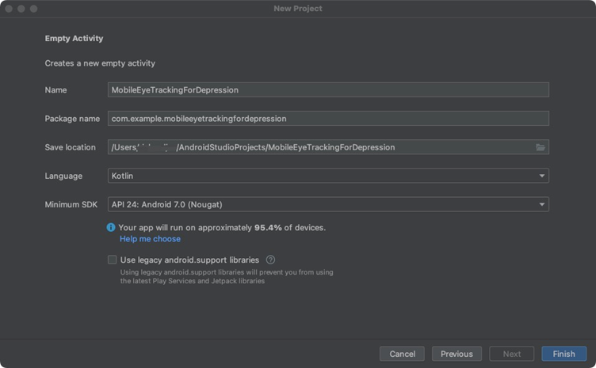
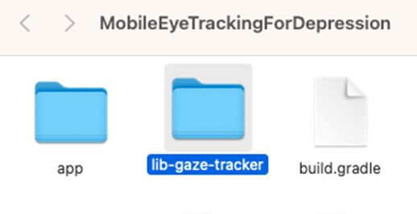
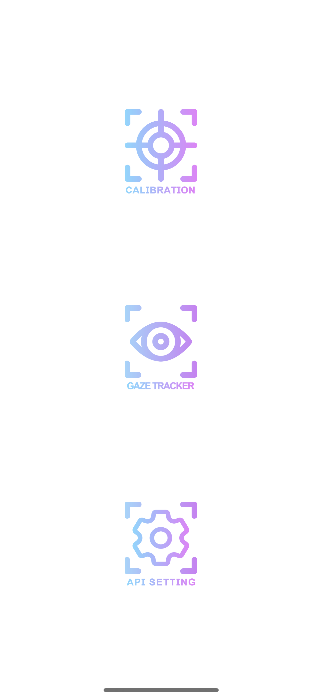
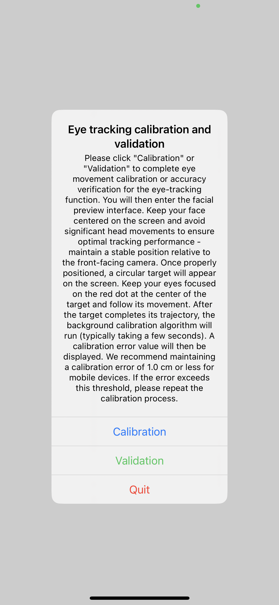
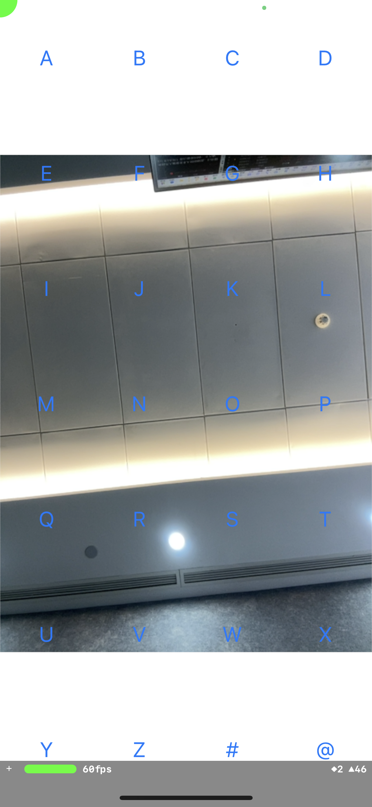
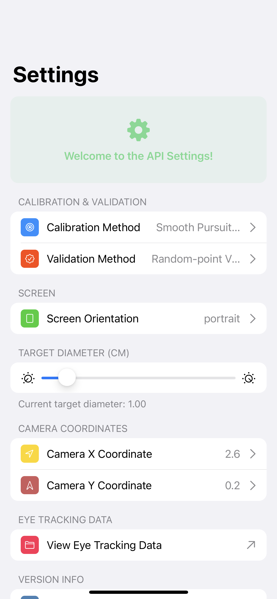

# Source Code for Experiments 1 and 2

## Experiment 1: Smartphone Eye Tracking Compared Against EyeLink

The source code for the Android App used in the testing is available from  [here](https://github.com/GanchengZhu/DataQualityWithEyeLink).

## Experiment 2: Smartphone Eye Tracking for Depression Symptom Detection

The source code for the Android App is available from [here](https://github.com/GanchengZhu/SmartphoneEyeTrackingDepression).

## Accessing the Smartphone Eye Tracking SDK

To access the smartphone eye-tracking SDK reported in this paper, please send a request to zhiguo@zju.edu.cn. Please note that the smartphone eye-tracking SDK is intended for academic use only. You will need to sign an end-user agreement before we share the smartphone eye-tracking SDK.

### Email Prompt

Please use the following email template for your request. Please keep the subject line unchanged:

```
Subject: Request for Accessing the Smartphone Eye Tracking SDK

Dear Prof. Zhiguo Wang,

I hope this message finds you well.

My name is [Your Name], and I am a [student/researcher] at [Your Affiliation]. I am writing to request the Smartphone Eye Tracking SDK.

We acknowledge that the use of this SDK is subject to certain restrictions. We will use this SDK solely for academic and research purposes, and we will not utilize it for commercial activities or disseminate it to others.

Thank you for considering my request. I look forward to receiving access to the SDK.

Best regards,
[Your Name]
```

---

# How to Integrate the SDK into Your App

## 1. Create a New Android Project  

Create a new Android project in Android Studio or use the template project provided by this Android SDK.



**Android Studio New Project Setup Diagram**  

**Note:** The SDK is primarily written in Java, with a small portion in Kotlin. While Kotlin can seamlessly call Java code, this SDK has not been fully tested with Kotlin. Therefore, it is recommended to use Java for integration.  

---

## 2. Gradle Integration of Local SDK  

1. **Create a `lib-gaze-tracker` folder** in your project’s root directory. 
  

2. Place `lib-gaze-tracker-release.aar` in this folder and configure its `build.gradle`:  
   ```groovy
   configurations.maybeCreate("default")
   artifacts.add("default", file('lib-gaze-tracker-release.aar'))
   ```  
   
3. Update `settings.gradle` in the project root:  
   ```groovy
   include ':lib-gaze-tracker'
   ```  
   
4. Add dependencies in the app module’s `build.gradle`:  
   ```groovy
   dependencies {
       // Load lib-gaze-tracker
       implementation project(path: ':lib-gaze-tracker')
   }
   ```  
   
5. - **Supported Architectures**: `armeabi-v7a` and `arm64-v8a` only.  
    ```groovy
   android {
      defaultConfig {
         ndk {
            abiFilters 'arm64-v8a', 'armeabi-v7a'
         }
      }
   }
   ```
---

## 3. Initialize the SDK

- Import classes in your activity class.
    ```java
    import org.gaze.tracker.core.GazeTracker;
    import org.gaze.tracker.widget.AutoFitSurfaceView;
    ```  
- Initialize gaze tracker.
    ```java
    private void initGazeTracker() {
        GazeTracker.create(this, (gazeTracker, initializationErrors) -> {
            Log.i(TAG, "Initialization callback");
            tracker = gazeTracker;
            tracker.setSessionName(getUserId());
            tracker.setErrorBarVisible(getSwitchState());
            tracker.drawCalibrationUI(() -> {
                Intent intent = new Intent(getBaseContext(), ExampleActivity.class);
                intent.setFlags(Intent.FLAG_ACTIVITY_NEW_TASK);
                startActivity(intent);
            });
        });
    }
  ```
- Call `initGazeTracker` at `onCreate` method.
    ```java
    @Override
    protected void onCreate(Bundle savedInstanceState) {
            super.onCreate(savedInstanceState);
            setContentView(R.layout.activity_main);
    
            rootLayout = findViewById(R.id.root_container);
            surfaceView = findViewById(R.id.surface_view);
            surfaceView.getHolder().setFormat(PixelFormat.RGBA_8888);
            surfaceView.getHolder().addCallback(this);
    
            // check the camera permission
            // if the camera permission denied, request the camera  permission.
            if (ActivityCompat.checkSelfPermission(this, PERMISSIONS[0])
                    == PackageManager.PERMISSION_GRANTED) {
                initGazeTracker();
            } else {
                ActivityCompat.requestPermissions(this, PERMISSIONS, REQ_PERMISSION);
            }
    }
    ```

- To preview user's face using Android `SurfaceView`.
    ```Java
   @Override
    public void surfaceCreated(@NonNull SurfaceHolder surfaceHolder) {
        Log.d(TAG, "surfaceCreated");
        WindowManager windowManager = (WindowManager) this.getSystemService(Context.WINDOW_SERVICE);
        int degree = 0;
        if (windowManager != null) {
            Display display = windowManager.getDefaultDisplay();
            switch (display.getRotation()) {
                case Surface.ROTATION_0:
                    degree = 0; // portrait
                    break;
                case Surface.ROTATION_90:
                    degree = 90; // landscape right
                    break;
                case Surface.ROTATION_180:
                    degree = 180; // portrait upsize
                    break;
                case Surface.ROTATION_270:
                    degree = 270; // landscape left
                    break;
            }
        }
        if (degree == 0 || degree == 180)
            surfaceView.setAspectRatio(480, 640);
        else {
            surfaceView.setAspectRatio(640, 480);
        }

        surfaceView.post(() -> {
                    if (tracker != null) {
                        tracker.setPreviewSurface(surfaceView.getHolder().getSurface());
                    }
                }
        );
    }
  ```
## 4. Sample Gaze Data

- Your Activity or Fragment needs to implement a specific interface — likely called GazeCallback — which the SDK uses to deliver gaze-related updates (e.g., gaze coordinates, timestamps, validity flags).
```Java
import org.gaze.tracker.bean.GazeSample;
import org.gaze.tracker.core.GazeTracker;
import org.gaze.tracker.enumeration.TrackingState;
import org.gaze.tracker.listener.GazeCallback;

public class ExampleActivity extends AppCompatActivity
        implements GazeCallback {
        
    @Override public void onGaze(GazeSample gazeSample) {
        if (gazeSample.getTrackingState() == TrackingState.SUCCESS) {
            isPointShow = true;
            x = gazeSample.getFilteredX();
            y = gazeSample.getFilteredY();
//            Log.i(TAG, "Calibrated: " + gazeSample.isHasCalibrated());
//            Log.i(TAG, String.format("x: %.2f, y: %.2f", x, y));
        } else {
            isPointShow = false;
        }

        dataBuffer.setLength(0);
        dataBuffer.append(gazeSample.getTimestamp()).append(",")
                .append(gazeSample.getTrackingState().getValue()).append(",")
                .append(gazeSample.isHasCalibrated() ? 1 : 0).append(",")
                .append(gazeSample.getRawX()).append(",").append(gazeSample.getRawY()).append(",")
                .append(gazeSample.getCalibratedX()).append(",").append(gazeSample.getCalibratedY())
                .append(",").append(gazeSample.getFilteredX()).append(",")
                .append(gazeSample.getFilteredY()).append(",").append(gazeSample.getLeftDistance())
                .append(",").append(gazeSample.getRightDistance()).append("\n");
        try {
            outputStreamWriter.write(dataBuffer.toString());
            outputStreamWriter.flush();
        } catch (IOException e) {
            e.printStackTrace();
        }

    }
}
```

- Get instance, add callback, and start sampling at `onCreate` method.
```Java
@Override protected void onCreate(@Nullable Bundle savedInstanceState) {
    gazeTracker = GazeTracker.getInstance();
    gazeTracker.addCallbacks(this);
    gazeTracker.startSampling();
}
```

---

# IOS SDK Documentation

IOS SDK is developing. 
Now, we have a App Demo on the App Store, you can visit it [here](https://apps.apple.com/cn/app/tcci-mobile-et/id6723893485).

# Quick Start Guide for the iOS App

## **Six suggestions for improving eye tracking accuracy**

**Please use this app indoors.** All of our models—including those from previous work—were trained on indoor data. After calibration, any significant change in lighting may degrade tracking accuracy.

**During calibration, remain silent.** Mouth movements can alter facial and eye features and reduce precision. If you must speak, please wear a mask to minimize facial motion.

**Keep your head movement minimal.** While the app tolerates natural motion, excessive head movement can impair tracking. For optimal results, consider using a headrest.

**Keep your face centered on the screen.** Position your face at the screen’s center and maintain a distance of approximately 30–40 cm—matching the conditions of our training dataset. Sitting too far away may diminish the eye-related features needed for accurate gaze estimation.

**Avoid the bottom quarter of the screen.** Tracking accuracy may suffer there, as users with thicker eyelids can have their lids obstruct key eye features.

**Focus on the calibration target.** During calibration, keep your gaze fixed on the moving dot as it travels across the screen.

## 1. Initiate Calibration  
Tap the `CALIBRATION` button on the main screen.  



## 2. Start Calibration Process  
A dialog will appear – select the `Calibration` button to begin eye-tracking calibration.  

  

## 3. Validate or Exit  
After completing calibration:  
- **If calibration error < 1.0 cm**: Tap `Validation` to enter the validation phase (follow the moving target with your gaze).  
- **To exit**: Tap `Quit` to return to the main screen.  

## 4. Gaze Tracking Demo  
From the main page:  
1. Select `GAZE TRACKER`  
2. Features include:  
   - Live front camera feed  
   - Letter grid (A-X)  
   - Real-time **green dot** indicating gaze position  

  

## 5. Customize Settings  
Access preferences via the `SETTING` button:  
- Adjustable parameters:  
  - Calibration/validation methods  
  - Screen orientation  
  - Target size  
  - Advanced options:  
  - Camera coordinates (⚠️ If modified, please refer to [this paper](http://dx.doi.org/10.1155/2024/2644725) for details.)
  

## 6. Review Validation Data  
Navigate to `View Eye Tracking Data` in the settings menu to access records during validation procedure.  

---

# Experiment Data Analysis

## Data Quality

Run the following code

```bash
cd smartphone_and_eyelink
python data_quality.py
```

## Plotting EyeLink and Phone Data

```bash
cd smartphone_and_eyelink
python participant_data_plotting.py right
```

## Histgram Plotting (Fig. 4)

```bash
cd smartphone_and_eyelink
python acc_pre_me_histgram_plotting.py
```

## Statistical Tests

```bash
cd smartphone_and_eyelink
python statistical_test.py
```

---
